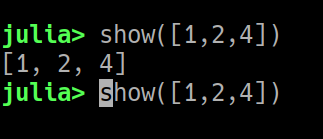
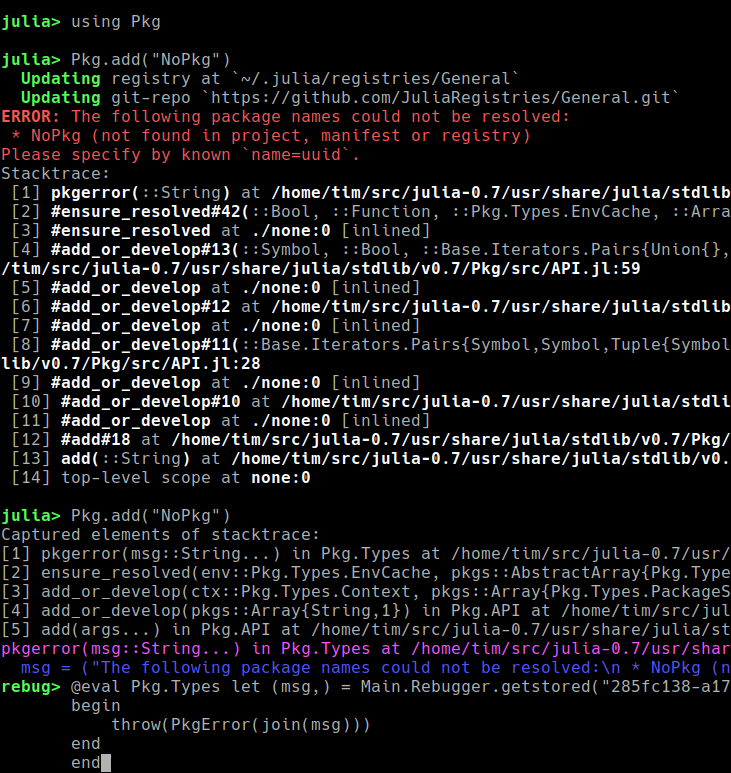

# Rebugger

[](https://travis-ci.org/timholy/Rebugger.jl)
[](https://ci.appveyor.com/project/timholy/Rebugger-jl/branch/master)
[](http://codecov.io/github/timholy/Rebugger.jl?branch=master)

Rebugger is an expression-level debugger for Julia.
It has no ability to interact with or manipulate call stacks (see [ASTInterpreter2](https://github.com/Keno/ASTInterpreter2.jl)),
but it can trace execution via the manipulation of Julia expressions.
It is in the very early stages of development, and users should currently expect bugs (please do [report](https://github.com/timholy/Rebugger.jl/issues) them).
Neverthess it may be of net benefit for some users.

The name "Rebugger" has 3 meanings:

- it is a REPL-based debugger (more on that below)
- it is the [Revise](https://github.com/timholy/Revise.jl)-based debugger
- it supports repeated-execution debugging

## Installation

For now, you have to install two packages:

```julia
(v1.0) pkg> add https://github.com/timholy/HeaderREPLs.jl.git
(v1.0) pkg> add https://github.com/timholy/Rebugger.jl.git
```

Also you **must** add something similar to the following lines to your `.julia/config/startup.jl` file:

```julia
try
    @eval using Revise
    # Turn on Revise's file-watching behavior
    Revise.async_steal_repl_backend()
catch
    @warn "Could not load Revise."
end

try
    @eval using Rebugger
    atreplinit(Rebugger.repl_init)
catch
    @warn "Could not turn on Rebugger key bindings."
end
```

The reason is that Rebugger adds some custom key bindings to the REPL, and **adding new
key bindings works only if it is done before the REPL starts.**

Starting Rebugger from a running Julia session will not do anything useful.

## Using Rebugger

Documentation is sparse right now. To get you started, there are two important keybindings:

- Alt-Shift-Enter maps to "step in"
- F5 maps to "capture stacktrace" (for commands that throw an error)

### Stepping in

Select the expression you want to step into by positioning "point" (your cursor)
at the desired location in the command line:



Now if you hit Alt-Shift-Enter, you should see something like this:


The magenta tells you which method you are stepping into.
The blue shows you the value(s) of any input arguments or type parameters.

Note the cursor has been moved to another `show` call. Hit Alt-Shift-Enter again.
Now let's illustrate another important display item: if you position your cursor
as shown and hit Alt-Shift-Enter again, you should get the following:


Note the yellow/orange line: this is a warning message, and you should pay attention to these.
In this case the call actually enters `show_vector`; if you moved your cursor there,
you could trace execution more completely.

### Capturing stacktraces

Choose a command that throws an error, for example:


Enter the command again, and this time hit F5:


Hit enter and you should see the error again, but this time with a much shorter
stacktrace.
That's because you entered at the top of the stacktrace.

You can use your up and down errors to step through the history, which corresponds
to going up and down the stack trace.

Sometimes the portions of the stacktrace you can navigate with the arrows
differs from what you see in the original error:



Note that only five methods got captured but the stacktrace is much longer.
Most of these methods, however, start with `#`, an indication that they are
generated methods rather than ones that appear in the source code.

**Note**: `Pkg` is one of Julia's standard libraries, and to step into or trace Julia's stdlibs
you must build Julia from source.

## Known issues

There are *many*. A few selected items:

- F5 sometimes doesn't work when your cursor is at the end of the line.
  Move your cursor anywhere else in that line and try again.
- Revise must be tracking the package/stdlib for any of this to work.
  Note the `Revise.track(Pkg)` line in the demo above.
  One exception is Base, for which tracking will be initiated automatically.
  For script use `includet(filename)` to include-and-track.
- There are known glitches in the display. When capturing stack traces, hit
  enter on the first one to rethrow the error before trying the up and down arrows
  to navigate the history---that seems to reduce the glitching.
  (For brave souls who want to help fix these,
  see [HeaderREPLs.jl](https://github.com/timholy/HeaderREPLs.jl))
- You cannot step into methods defined at the REPL.
- Stacktraces currently don't capture from methods that start with `#`.
  However, once you get to one of their callers you can step into them.
- Rebugger runs best in Julia 1.0. While it should run on Julia 0.7,
  a local-scope deprecation can cause some
  problems. If you want 0.7 because of its deprecation warnings and are comfortable
  building Julia, consider building it at commit
  f08f3b668d222042425ce20a894801b385c2b1e2, which removed the local-scope deprecation
  but leaves most of the other deprecation warnings from 0.7 still in place.
- For now you can't step into constructors (it tries to step into `(::Type{T})`)
- If you start `dev`ing a package that you had already loaded, you need to restart
  your session (https://github.com/timholy/Revise.jl/issues/146)
